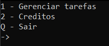
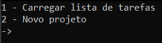
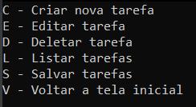
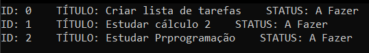

# Lista de Tarefas em C

Um sistema simples de gerenciamento de tarefas feito em linguagem C, utilizando lista duplamente encadeada e arquivos binários para salvar e carregar tarefas.

---

## Funcionalidades

- Criar tarefas com título e status
- Editar título ou status de tarefas existentes
- Deletar tarefas por ID
- Listar todas as tarefas
- Salvar e carregar tarefas de um arquivo
- Interface em terminal
- Controle automático de IDs

---

## Como compilar

Este projeto usa um `Makefile`. Para compilar, execute:

```bash
make
````

Para limpar os arquivos objeto:

```bash
make clean
```

---

## Como executar

Após a compilação, execute:

```bash
./listaDeTarefas
```

---

## Estrutura de Pastas

```
.
├── src/               # Código-fonte
├── include/           # Arquivos de cabeçalho
├── data/              # Arquivo binário com tarefas
├── build/             # (Opcional) arquivos objeto
├── Makefile
└── README.md
```

---

## Estrutura dos Dados

* `t_lista`: estrutura principal que armazena ponteiros para o primeiro e último elementos da lista, além do tamanho.
* `no_tarefa`: nó da lista duplamente encadeada contendo a tarefa e ponteiros para anterior e próximo.
* `t_tarefa`: contém ID, título (até 500 caracteres) e status (`A_FAZER`, `ANDAMENTO`, `FINALIZADA`).

---

## Arquivo de Dados

As tarefas são salvas e carregadas a partir de um arquivo binário:

```
./data/arquivo.txt
```

---

## 📷 Capturas de Tela







---

## Autor

**Gabriel Queiroz Teles** - <a href="https://github.com/QTelesGabriel">Github</a>

> Projeto acadêmico para praticar estruturas de dados e persistência em C.

---